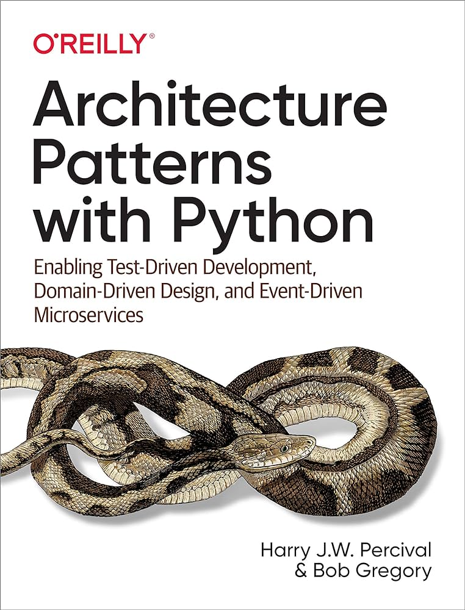

# Overview

Basic TypeScript implementation of different patterns from the Architecture Patterns with Python - Enabling Test-Driven Development, Domain-Driven Design, and Event-Driven Microservices book.

## Implementations

- [1-basic](./1-basic)
  - Implementation till the 6 chapter (inclusive)
  - Entities, Value Objects, Repositories, Unit of Work, Application Services (Use Cases), Unit Tests, Integration Tests, E2E tests, [Object Mothers](https://martinfowler.com/bliki/ObjectMother.html)
    - I've implemented entities in a way that they expose only read-only properties leveraging TypeScript types, so no one can change them directly (only via methods, which drive invariants). This approach works just fine, but still might be arguable because of `as` casting (refer to `as PublicProps
` in [./1-basic/shared/Entity.ts](./1-basic/shared/Entity.ts)).
- [2-basicAggregates](./2-basicAggregates)
  - Implementation till the 7 chapter (inclusive)
  - The same as in the previous plus Aggregates, Optimistic Concurrency but without messages / events / commands
    - Optimistic Concurrency is implemented using the "REPEATABLE READ" transaction isolation level and the `version` column
- [3-aggregatesAndBasicDomainEvents](./3-aggregatesAndBasicDomainEvents)
  - Implementation till the 8 chapter (inclusive)
  - The same as in the previous plus a simple message bus
    - Aggregates expose internal domain events and they drive some side effects like sending emails
    - Events are used internally only
    - The core of the system is the same as in the previous implementations (it is NOT built around message processing yet)
  - Since more components are involved I've also introduced Composition Root pattern to wire up the components and to be able to swap them with fake alternatives in tests
- [4-eventDriven](./4-eventDriven)
  - Implementation till the 12 chapter (inclusive)
  - The same as in the previous but the implementation is built around message processing and follows CQRS
    - Application Services (Use Cases) are implemented as message handlers
    - Messages are split logically to Commands, external Commands, internal Events, external Events
    - External Events are emitted outside of the system and external Commands are received from outside of the system (via Redis)
    - The system is split into a read model and a write model

Implementations 1, 2, 3, and 4 are independent from each other. There is NO best implementation (aka a silver bullet) that always fits, but rather an implementation should be picked according to the current requirements and complexity. For simple CRUD applications, none of the above implementations are a good fit. Instead, you could use a framework per your taste, any ORM that you like, and even execute queries directly from controllers. If your application is more complex and you need to implement quite some business logic then one of the implementations above may be a good fit.

Each of the above implementations is split into:
- Controller -> Application Services (Use Cases) (business logic orchestration) -> Entities (business logic)

Some simple requests (e.g. requests to query data) are simply handled as follows:
- Controller -> Queries to the DB (to read models)
  - A good example is in the 4th implementation. This is not surprising, because this implementation follows CQRS. Requests to query data are handled directly in the controllers (e.g. [./4-eventDriven/entrypoints/webServer/controllers/GetOrderAllocationsController.ts](./4-eventDriven/entrypoints/webServer/controllers/GetOrderAllocationsController.ts)).

Chapter 13 (Dependency Injection) is out of scope of this repository.

## How to start locally

- Install Bun https://bun.sh (minimum required version is 1.0.25)
- Open an implementation folder (e.g. `cd 3-aggregatesAndBasicDomainEvents`)
- Run `bun install`
- Run `docker run --name postgres -e POSTGRES_PASSWORD=postgres -p 5432:5432 -d postgres` (it will create a docker container with a Postgres database)
  - You can start the container on any port you like or you can use an existing PostgresSQL instance
    - The connection can be configured by using the following envs:
      - `PG_HOST` (default is `127.0.0.1`)
      - `PG_PORT` (default is `5432`)
      - `PG_USER` (default is `postgres`)
      - `PG_PASSWORD` (default is `postgres`)
      - `PG_DB_NAME` (default is `postgres`)
  - The database schema is different from implementation to implementation, so if you want to switch between implementations you need to drop the database and create it again (simply remove the container and create it again)
- To start the event-driven implementations you also need to start a Redis container `docker run --name redis -p 6379:6379 -d redis`
  - You can start the container on any port you like or you can use an existing Redis instance
    - The connection can be configured by using the following envs:
      - `REDIS_HOST` (default is `127.0.0.1`)
      - `REDIS_PORT` (default is `6379`)
- Run tests
  - `npm run test`
  - `npm run test:infra`
  - `npm run test:e2e`
  - The 4th implementation also has some integration tests `npm run test:integ`
- Start the server `npm run start:ts`
  - Access endpoints via `http://localhost:3000/<route>`
- Refer to the `route.ts` file of the current implementation to find all routes (e.g. [./3-aggregatesAndBasicDomainEvents/entrypoints/webServer/routes.ts](./3-aggregatesAndBasicDomainEvents/entrypoints/webServer/routes.ts))
- Refer to the `messagesMapping.ts` file of the current implementation to find all message subscriptions (internal and external) (e.g. [./4-eventDriven/entrypoints/messageBus/messagesMapping.ts](./4-eventDriven/entrypoints/messageBus/messagesMapping.ts))
